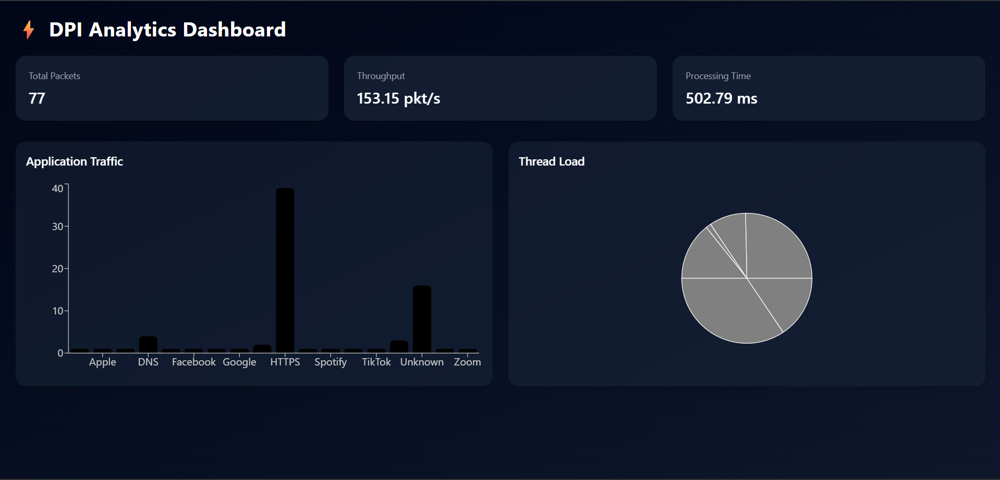

# Multi-threaded DPI Engine with Analytics Dashboard

A production-grade **Deep Packet Inspection (DPI)** system engineered in C++ with a complete observability pipeline — combining low-level network packet processing with a full-stack analytics interface. Designed to demonstrate systems programming depth alongside modern full-stack integration.

> Processes live and captured network traffic, classifies applications via SNI extraction, enforces rule-based filtering policies, and exports structured telemetry consumed by a real-time React dashboard.

---

## Architecture

```
PCAP File / Network Interface
           │
           ▼
┌──────────────────────────────────────┐
│            C++ DPI Engine            │
│                                      │
│  ┌────────────────┐                  │
│  │  Load Balancer │  5-tuple hashing │
│  │  (Queue-aware) │─────────────────▶│
│  └────────────────┘                  │
│         │                            │
│         ▼                            │
│  ┌──────────────────────────────┐    │
│  │  Worker Thread Pool          │    │
│  │  FP0 | FP1 | FP2 | FP3      │    │
│  └──────────────────────────────┘    │
│         │                            │
│  ┌──────▼──────────────────────┐     │
│  │  Packet Inspection Layer    │     │
│  │  • TLS SNI Extraction       │     │
│  │  • App Classification       │     │
│  │  • Rule Engine (IP/App/DNS) │     │
│  └─────────────────────────────┘     │
└──────────────────┬───────────────────┘
                   │
                   ▼
             stats.json
                   │
                   ▼
     ┌─────────────────────────┐
     │   Node.js / Express API │  REST endpoint serving telemetry
     └─────────────┬───────────┘
                   │
                   ▼
     ┌─────────────────────────┐
     │     React Dashboard     │  Vite + Tailwind + Recharts
     └─────────────────────────┘
```

---

## Features

### Systems Engineering
- **Multi-threaded architecture** — dedicated Load Balancer thread distributes flows across a configurable worker pool (`FP0`–`FPn`)
- **5-tuple flow hashing** — consistent per-flow routing using source IP, destination IP, source port, destination port, and protocol, ensuring ordered packet processing per connection
- **Adaptive queue-aware scheduling** — load balancer monitors per-thread queue depth and redistributes work dynamically to prevent thread starvation
- **Lock-free design considerations** — minimized shared state between threads to reduce contention and maximize throughput

### Deep Packet Inspection
- **TLS SNI extraction** — parses ClientHello handshake messages to extract Server Name Indication without decrypting traffic
- **Application classification** — maps SNI and flow metadata to known applications (YouTube, Facebook, etc.)
- **Rule-based filtering engine** with support for:
  - IP-level blocking (source/destination)
  - Application-layer blocking by classified app name
  - Domain blocking via SNI match

### Observability & Analytics
- Exports structured runtime telemetry to `stats.json` after each processing run
- Tracks: total packets processed, wall-clock processing time, packets/sec throughput, and per-thread packet distribution
- JSON schema designed for direct consumption by REST APIs and visualization layers

### Full-Stack Integration
- **Express.js API** — lightweight backend exposing `/stats` endpoint serving the engine's output
- **React + Vite frontend** — fast, modular dashboard built with Tailwind CSS and Recharts
- Clean separation of concerns across engine → API → UI layers

---

## Tech Stack

| Layer | Technology |
|---|---|
| DPI Engine | C++17, POSIX Threads, Raw Sockets, libpcap |
| Backend | Node.js, Express.js |
| Frontend | React, Vite, Tailwind CSS, Recharts |
| Data Exchange | JSON |

---

## Project Structure

```
dpi-engine-analytics/
├── src/                  # C++ engine source — packet parser, load balancer, worker threads
├── include/              # C++ headers — flow structs, thread interfaces, rule engine
├── backend/              # Express API — serves stats.json over HTTP
├── dashboard/            # React frontend — Vite + Tailwind + Recharts
│   └── public/
│       └── dashboard.png
├── stats.sample.json     # Sample telemetry output
└── README.md
```

---

## Getting Started

### Prerequisites
- `g++` with C++17 support
- `libpcap` installed (`sudo apt install libpcap-dev` on Linux)
- Node.js v16+
- A `.pcap` file for testing (e.g. captured via Wireshark)

### 1. Compile the Engine

```bash
g++ -std=c++17 -O2 -I include -o dpi_engine.exe src/*.cpp
```

### 2. Run the Engine

```bash
# Basic run
./dpi_engine.exe <path-to-file.pcap>

# With filtering rules
./dpi_engine.exe <path-to-file.pcap> --block-ip 192.168.1.1
./dpi_engine.exe <path-to-file.pcap> --block-app YouTube
./dpi_engine.exe <path-to-file.pcap> --block-domain example.com
```

On completion, `stats.json` is written to the project root.

### 3. Start the Backend

```bash
cd backend
npm install
node index.js
# API available at http://localhost:3000/stats
```

### 4. Start the Dashboard

```bash
cd dashboard
npm install
npm run dev
# UI available at http://localhost:5173
```

---

## CLI Reference

| Flag | Argument | Description |
|---|---|---|
| `--block-ip` | `<ip>` | Drop all packets to/from specified IP address |
| `--block-app` | `<name>` | Block traffic classified as this application |
| `--block-domain` | `<domain>` | Block flows matching this domain via SNI |

---

## Sample Output (`stats.json`)

```json
{
  "total_packets": 77,
  "processing_time_ms": 502.78,
  "packets_per_sec": 153.14,
  "threads": {
    "FP0": 39,
    "FP1": 14,
    "FP2": 2,
    "FP3": 22
  }
}
```

Per-thread distribution reflects the load balancer's flow routing decisions — uneven distribution is expected due to flow size variance, not scheduling inefficiency.

---

## Dashboard



The dashboard visualizes per-thread workload distribution, packet throughput, and end-to-end processing latency — providing operational insight into engine performance across processing runs.

---

## Roadmap

- [ ] Live interface capture — replace PCAP file input with real-time sniffing
- [ ] WebSocket-based streaming updates to dashboard
- [ ] Configurable rule sets via external JSON policy file
- [ ] Extended protocol coverage — HTTP/2, QUIC, DNS-over-HTTPS
- [ ] Exportable reports (CSV / PDF)
- [ ] Docker Compose setup for one-command deployment

---

## Acknowledgements

Inspired by [perryvegehan](https://github.com/perryvegehan) — whose packet processing architecture influenced the thread model design of this engine.

---

<p align="center">
  <strong>Shaswat Pathak</strong> &nbsp;·&nbsp;
  <a href="https://github.com/ethyashpathak">GitHub</a> &nbsp;·&nbsp;
  <a href="https://ethyashpathak.netlify.app/">Portfolio</a>
</p>